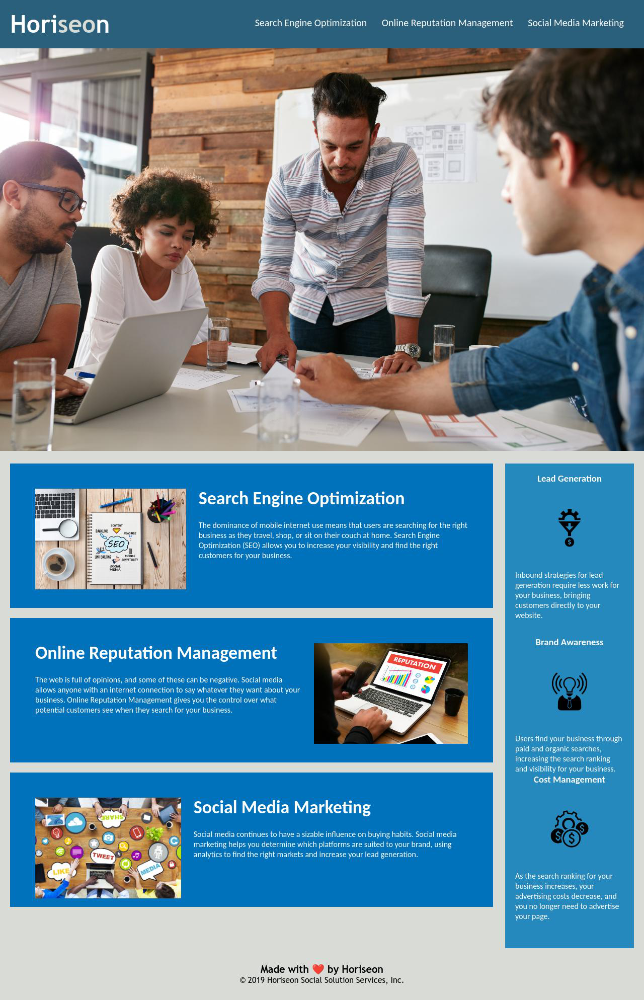

# 01-Horiseon-Marketing
Horiseon Marketing - website accessibility update

## Description 

Horiseon Marketing needed a update of their website to improve accessiblitly of their website. 
The project outcome was to improve accessibility of the webite for the largest number of users possible, by adjustng the element of the webiste and keeping with WAI-ARIA satndards for Website Accessibility.

The webiste was fully optimalised for the search engine, as well as their codebas follows accessibility standards.

## Installation

webiste link: https://porlowska.github.io/01-Horiseon-Marketing/

## Usage 

THe webiter is now fully accessible and extended the number of users by those who need to use screen reading devices. 

```md

```

## Credits

https://www.w3.org/
course materials Xed 
Personal notes

## License

MIT Licence